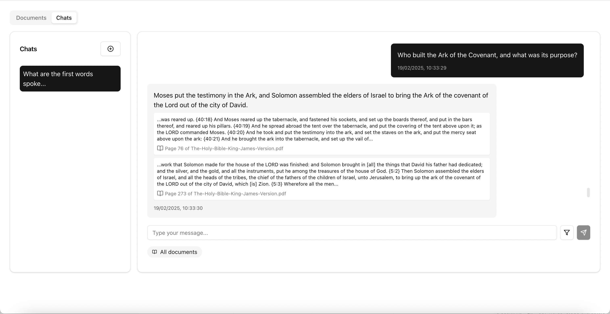
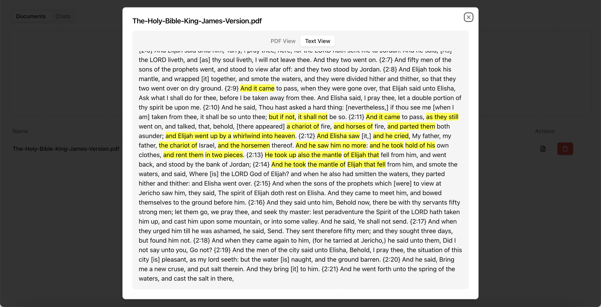
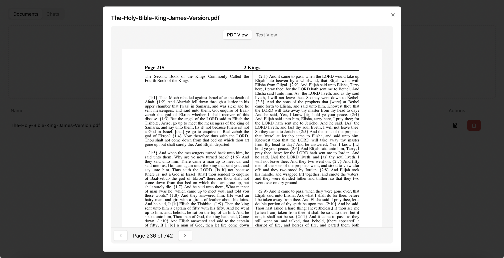
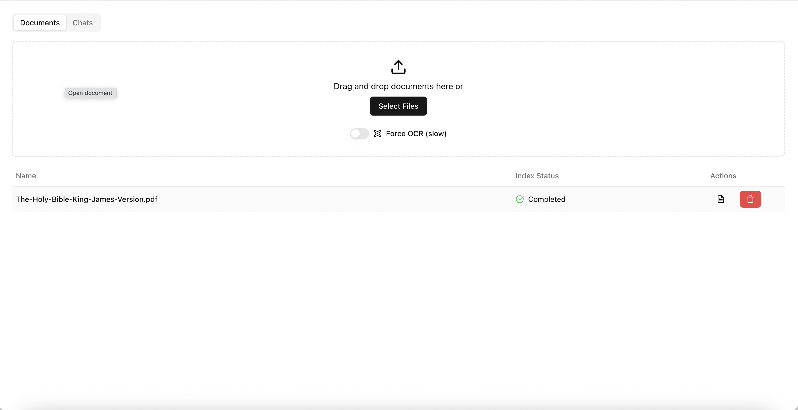
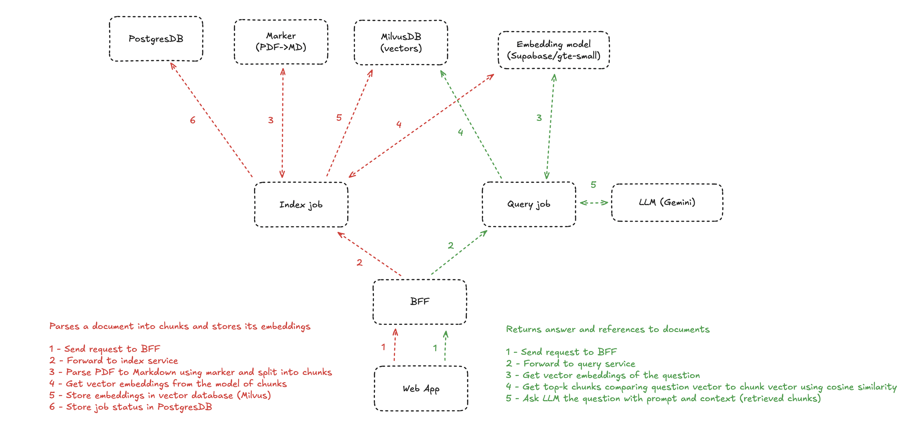

# ⚡️ PDF RAG Kickstart template

A production-ready template for building Retrieval-Augmented Generation (RAG) applications. This template provides a complete setup for document processing, vector storage, and AI-powered question answering and kickass UI.

| Chat  | Document lookup with highligh  | PDF viewer | Documents list |
| ----- | ------------------------------ | ---------- | -------------- |
|  |  |  |  |

## Features

- 📄 PDF document processing with OCR
- 📚 Multi-document conversation context with filtering
- 🎯 Click-to-view document references with highlighting
- 💾 Milvus DB with billions of vectors scale support
- 🌐 Slick web interface
- 🔄 Large documents processing and status updates


## Architecture



The application is built using a microservices architecture with the following components:

- **BFF (Backend for Frontend)**: API gateway handling client requests
- **Index Service**: Processes and indexes documents
- **Query Service**: Handles question answering using RAG
- **Marker Server**: Converts PDFs to markdown format
- **Web App**: React-based frontend interface
- **Milvus**: Vector DB for storing embeddings
- **PostgreSQL**: Relational DB for metadata storage

## Tech Stack

- **Frontend**: React, TypeScript, Tailwind, Shadcn
- **Backend**: Bun
- **Databases**: PostgreSQL, Milvus
- **AI/ML**: Google Gemini (LLM), HuggingFace Transformers (Embeddings)

## Getting Started

### Prerequisites

- Docker
- Google Cloud API key for Gemini

### Installation

1. Clone the repository:

```bash
git clone https://github.com/renton4code/pdf-rag.git
cd pdf-rag
```

2. Set up environment variables:

```bash
export GEMINI_API_KEY=<your-gemini-api-key>
```

3. Build and start the application:

```bash
docker compose up --build
```

4. Access the application at `http://localhost:5173`


## Usage

1. **Upload Documents**
   - Drag and drop PDF files into the web interface
   - Toggle OCR processing for scanned/handwritten documents
   - Monitor processing status in real-time

2. **Chat Interface**
   - Start new conversations
   - Filter documents for specific contexts
   - View document references in responses
   - Click references to view source documents
  
## Common Issues

### Document Processing

- Index step is stuck or failing with OCR: Marker consumes a lot of RAM, so make sure you have enough memory allocated to Docker. Increase RAM limit in Docker Desktop to at least 16GB.

- Inacurate OCR: Marker supports LLM flag improving accuracy, you may want to add the flag to Docker comand:
```CMD ["python", "-m", "marker_server", "--host", "0.0.0.0", "--port", "8001", "--use_llm", "--gemini_api_key" "<your-gemini-api-key>"]```

### Querying

- Wrong referenced page (off by one): Text chunks intentionally overlap to provide more context to LLM. It can happen that referenced text is from the previous or next page. You may want to tweak the `text2chunks` function in the `services/index/index.ts` file to change the overlap or disable it.

- No results or broken references: Double check the system prompt in the `services/query/index.ts` file. JSON structure depends on the prompt, so promt changes may break the parsing of the response.

## Local Development

### Change the embedding model

- Change the embedding model in the `services/index/embedder.ts` file
- Change the vector dimensions in the `services/index/milvus-client.ts` file

### Change the LLM provider/model/prompt

- Change the LLM in the `services/query/index.ts` file

# Manual evaluation
Based on Q&A with a large document (700+ pages) in comparison to [RagFlow](https://github.com/infiniflow/ragflow)

| RAG     | Embeddings model       | LLM                          | Vector ranking             | Reranking | [HyDE](https://arxiv.org/abs/2212.10496) |
| ------- | ---------------------- | ---------------------------- | -------------------------- | --------- | ---------------------------------------- |
| pdf-rag | Supabase/gte-small     | google/gemini-2.0-flash      | cosine                     | no        | no                                       |
| RAGFlow | BAAI/bge-large-zh-v1.5 | deepseek-ai/deepseek-v3-chat | weighted keywords + cosine | no        | yes                                      |


| Question                                                                          | Answer (pdf-rag)                                                                                                                                           | Answer (RAGFlow)                                                                                                                                        |
| --------------------------------------------------------------------------------- | ---------------------------------------------------------------------------------------------------------------------------------------------------------- | ------------------------------------------------------------------------------------------------------------------------------------------------------- |
| What are the first words spoken by God in the Bible?                              | -                                                                                                                                                          | -                                                                                                                                                       |
| Who was the first murderer in the Bible, and whom did he kill?                    | -                                                                                                                                                          | -                                                                                                                                                       |
| How many days and nights did it rain during the Great Flood?                      | It rained for forty days and forty nights.(1)                                                                                                              | According to the knowledge base, it rained for **forty days and forty nights** during the Great Flood .(1)                                              |
| What was the name of the mountain where Moses received the Ten Commandments?      | Mount Sinai(1)                                                                                                                                             | -                                                                                                                                                       |
| Which Gospel contains the Sermon on the Mount?                                    | -                                                                                                                                                          | -                                                                                                                                                       |
| Who was the first king of Israel?                                                 | -                                                                                                                                                          | -                                                                                                                                                       |
| In which book of the Bible is the story of David and Goliath found?               | -                                                                                                                                                          | -                                                                                                                                                       |
| What is the shortest verse in the Bible, and where is it found?                   | -                                                                                                                                                          | -                                                                                                                                                       |
| Who was swallowed by a great fish and later preached in Nineveh?                  | Jonah was swallowed by a great fish and later preached in Nineveh.(1)                                                                                      | According to the knowledge base, **Jonah** was swallowed by a great fish and later preached in Nineveh.(1)                                              |
| What are the names of the first four books of the New Testament?                  | -                                                                                                                                                          | -                                                                                                                                                       |
| Which apostle denied Jesus three times before the rooster crowed?                 | Peter denied Jesus three times before the rooster crowed.(1)                                                                                               | According to the knowledge base, **Peter** is the apostle who denied Jesus three times before the rooster crowed.(1)                                    |
| What was the name of the disciple who betrayed Jesus for thirty pieces of silver? | Judas betrayed Jesus.(1)                                                                                                                                   | According to the knowledge base, **Judas Iscariot** was the disciple who betrayed Jesus for thirty pieces of silver.(1)                                 |
| What was Paul’s original name before his conversion?                              | -                                                                                                                                                          | According to the knowledge base, **Paul’s original name before his conversion was Saul**.(1)                                                            |
| Who was the first person to see Jesus after His resurrection?                     | -                                                                                                                                                          | According to the knowledge base, **Mary Magdalene** was the first person to see Jesus after His resurrection(1)                                         |
| What are the three gifts the Wise Men brought to baby Jesus?                      | -                                                                                                                                                          | -                                                                                                                                                       |
| What is the name of the last book in the Bible?                                   | -                                                                                                                                                          | -                                                                                                                                                       |
| Which Old Testament prophet was taken to heaven in a chariot of fire?             | Elijah was taken to heaven in a chariot of fire.(1)                                                                                                        | According to the knowledge base, **Elijah** was the Old Testament prophet taken to heaven in a chariot of fire.(1)                                      |
| Who built the Ark of the Covenant, and what was its purpose?                      | Moses put the testimony in the Ark, and Solomon assembled the elders of Israel to bring the Ark of the covenant of the Lord out of the city of David.(0.5) | According to the knowledge base, **Bezalel** and **Oholiab**, along with skilled craftsmen, were instructed by God to build the Ark of the Covenant.(1) |
| What was the name of the garden where Adam and Eve lived?                         | The garden was called Eden.(1)                                                                                                                             | According to the knowledge base, the garden where Adam and Eve lived was called **the Garden of Eden**.(1)                                              |
| How many plagues did God send upon Egypt before Pharaoh let the Israelites go?    | The provided texts mention multiple plagues sent upon Egypt, but do not specify the exact number of plagues before Pharaoh let the Israelites go. (0.5)    | According to the knowledge base, God sent **ten plagues** upon Egypt before Pharaoh finally let the Israelites go.(1)                                   |

- Total score of **pdf-rag**:  0.4 (8 of 20)
- Total score of **RAGFlow**: 0.5 (10 of 20)


